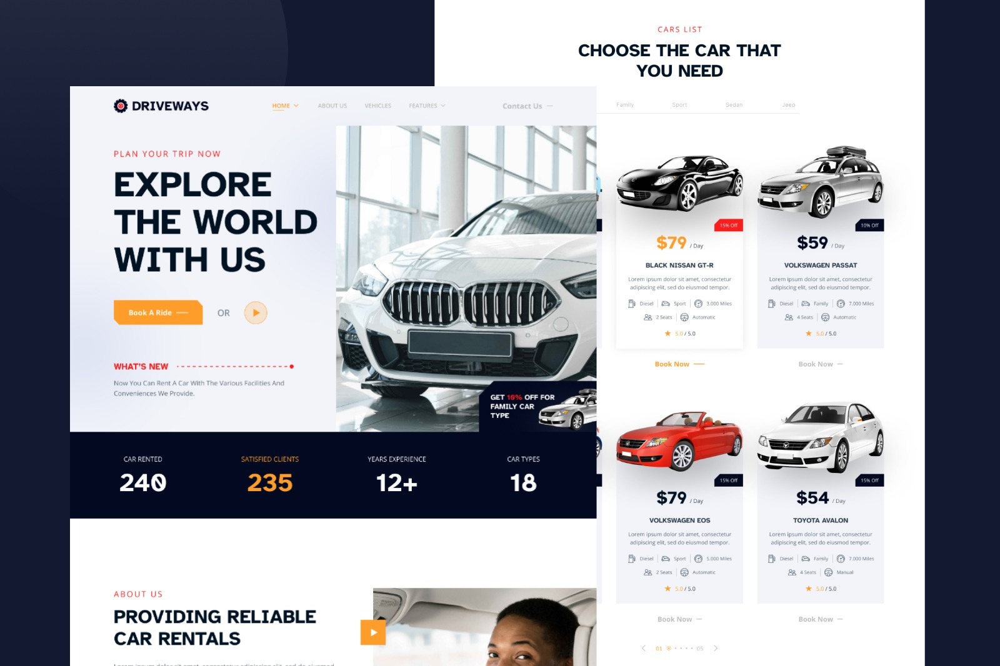

## 🚗 DriveWays

Uma landing page moderna e totalmente responsiva de uma concessionária fictícia, desenvolvida com foco em aprendizado prático de front-end, principalmente em **JavaScript**, estruturação de interfaces e resolução de problemas de responsividade.

O projeto simula um site real de concessionária utilizando apenas **HTML**, **CSS** e **JavaScript**, sem frameworks ou bibliotecas externas, com o objetivo de fortalecer os fundamentos do desenvolvimento web.

---

## 🌐 Preview do Projeto

Você poderá visualizar o projeto aqui:

🔗 em breve...

---

## 📸 Preview



---

## 🛠️ Tecnologias Utilizadas

* **HTML5**
* **CSS3**
* **JavaScript**
* **Design Responsivo**
* **Mobile First**

---

## 🎯 Objetivos do Projeto

O objetivo deste projeto é:

* Aprender e praticar **JavaScript**
* Melhorar habilidades de manipulação do DOM
* Praticar desenvolvimento responsivo
* Melhorar estruturação e organização de layouts
* Resolver problemas reais de interface e responsividade
* Construir uma landing page totalmente responsiva
* Fortalecer os fundamentos do front-end sem uso de frameworks

---

## 📱 Responsividade

O layout foi desenvolvido para se adaptar a diferentes tamanhos de tela:

* 📱 Dispositivos mobile
* 💻 Tablets
* 🖥️ Desktop

O projeto segue a abordagem **Mobile First**, utilizando media queries para adaptar a interface conforme o tamanho da tela.

---

## 🚀 Como Executar o Projeto

1. Clone este repositório:

```bash
git clone https://github.com/gabriel707alves/DRIVEWAYS.git